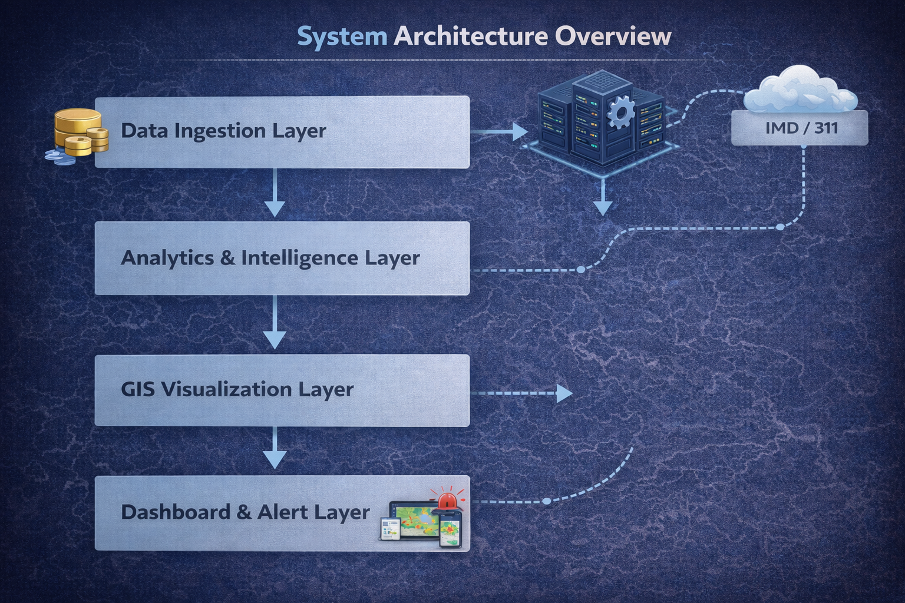
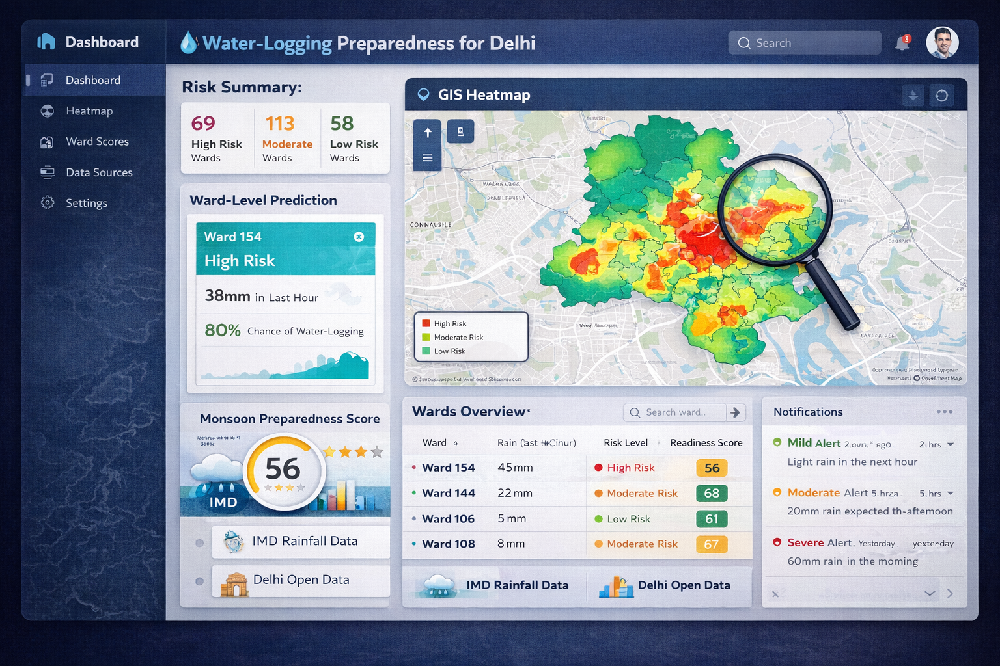

# waterlogging-intelligence-system
AI & GIS-based ward-level water-logging hotspot mapping and risk prediction system designed to support proactive monsoon planning and data-driven urban governance in Delhi.

**Hack4Delhi Submission – Smart Urban Waterlogging Prediction at Ward Level**
---

## 1. Problem Statement
Every monsoon, Delhi faces **severe waterlogging**, disrupting traffic, damaging property, and impacting citizens’ lives. Municipal authorities often respond **reactively**, leading to delays and inefficiencies.  

Our goal: **Predict waterlogging risk at the ward level before floods occur**, enabling proactive planning and rapid response.

---

## 2. Solution
The **Waterlogging Intelligence System (WIS)** uses **AI + GIS data** to:

- Map waterlogging hotspots across Delhi wards.
- Predict **risk levels** based on historical rainfall, drainage capacity, elevation, and urban features.
- Provide a **visual dashboard** for decision-makers to prioritize preventive measures.

**Impact:**  
- Helps MCD & Disaster Management Authorities act before flooding occurs.  
- Supports urban planners in improving infrastructure.  
- Reduces citizen inconvenience and economic losses.

---

## 3. Key Features
- **Ward-level prediction:** Granular, actionable insights.  
- **Data-driven AI model:** Leverages historical flood and rainfall data.  
- **GIS integration:** Interactive maps highlight high-risk areas.  
- **Proactive alerts:** Potential for future SMS/email alerts to authorities.  

---

## 4. System Architecture

**Flow Overview:**
1. **Data Collection:** Rainfall, elevation, drainage, past waterlogging incidents.  
2. **Preprocessing:** Clean and align spatial & temporal datasets.  
3. **Modeling:** Train AI model to classify wards into **risk categories** (High, Medium, Low).  
4. **Visualization:** Generate ward-level heatmaps and dashboards.  
5. **Decision Support:** Authorities can prioritize resource allocation.

---

## 5. Technologies Used
Frontend: React (HTML, CSS)
Mapping & GIS: Leaflet / Mapbox
Backend: Python (Flask / FastAPI)
Machine Learning: Scikit-learn
Database: PostgreSQL / Firebase
Data Sources: IMD rainfall data, Delhi Open Government Data
 

---

## 6. Demo / Visual Output
*Example Waterlogging Risk Map for Delhi Wards:*

---

## 7. Future Enhancements
- **Real-time data integration:** Incorporate live rainfall & IoT sensors.  
- **Predictive alerts:** SMS/email notifications to MCD staff.  
- **Mobile-friendly dashboard:** For field engineers to check risk on the go.  
- **Integration with Smart City initiatives** for urban resilience planning.

This is an early-stage prototype built for Hack4Delhi.

